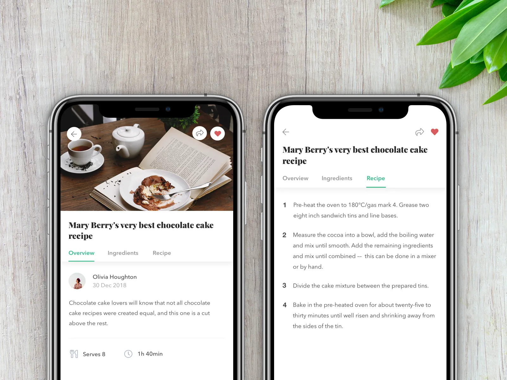
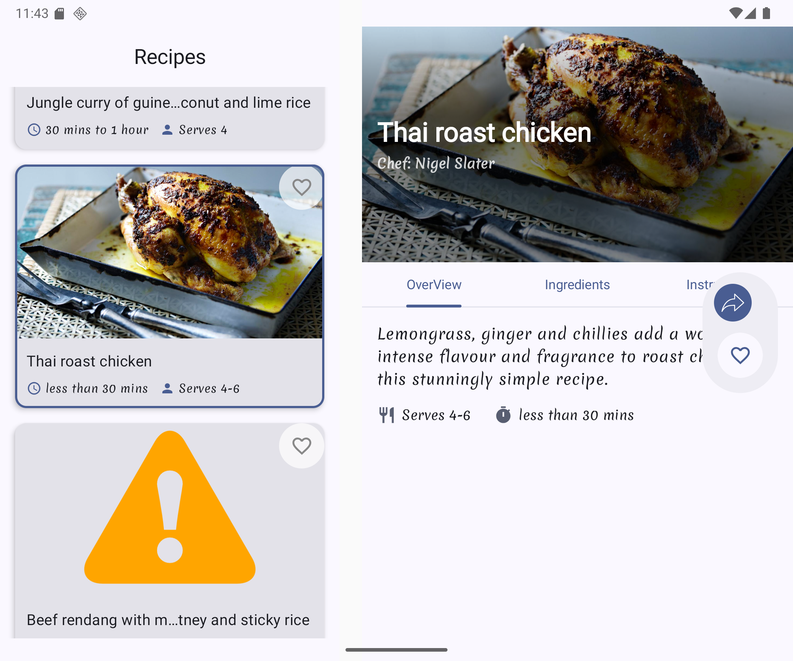

# BRecipes Android App

This is a Sample  using the BRecipes API, built with Jetpack Compose, Ktor, and Hilt. It allows users to browse, search, and manage holiday food recipes from the BRecipes API.

## Features

*   **Browse Recipes**: View a paginated list of holiday recipes.
*   **Search Recipes**: Find specific recipes by title or cuisine.
*   **Recipe Details**: View detailed information for each recipe.
*   **Offline Support**: Recipes can be cached for offline viewing (using Room).
*   **User Authentication**: Securely log in and interact with the API.
*   **Modern UI**: Built with Jetpack Compose for a beautiful and responsive user experience.
*   **Adaptive UI**: Supports UIs for large screens, foldables, and tablets.
*   **Dependency Injection**: Hilt for robust and scalable dependency management.
*   **Network Requests**: Ktor for efficient and flexible HTTP client operations.

## Technologies Used

*   **Framework**:
    *   [Jetpack Compose](https://developer.android.com/jetpack/compose): Modern Android UI toolkit.
*   **Networking**:
    *   [Ktor Client](https://ktor.io/docs/client-overview.html): Multiplatform asynchronous HTTP client.
    *   [Kotlinx Serialization](https://github.com/Kotlin/kotlinx.serialization): For JSON serialization/deserialization with Ktor.
    *   [Coil](https://coil-kt.github.io/coil/): Image loading library for Android, with Ktor integration.
*   **Data Persistence**:
    *   [Room](https://developer.android.com/topic/libraries/architecture/room): Android Architecture Component for local data storage.
    *   [Paging 3](https://developer.android.com/topic/libraries/architecture/paging/v3-overview): For efficient loading and displaying large datasets.
*   **Dependency Injection**:
    *   [Hilt (Dagger)](https://developer.android.com/training/dependency-injection/hilt-android): A dependency injection library for Android.
*   **Other Libraries**:
    *   [AndroidX Core KTX](https://developer.android.com/kotlin/ktx): Kotlin extensions for AndroidX libraries.
    *   [Lifecycle Runtime KTX](https://developer.android.com/topic/libraries/architecture/lifecycle): Lifecycle-aware components.
    *   [Splash Screen API](https://developer.android.com/develop/ui/views/launch/splash-screen): For a smooth app launch experience.

## Screenshots



_ Browse through a wide variety of holiday recipes._



_ Detailed recipe view, optimized for larger screens._


_Compact View Of The  Recipe Details Screen._

## Getting Started

### Prerequisites

*   Android Studio latest stable version.
*   JDK 17 or higher.

### API Configuration

This app relies on the BRecipes API. You need to configure the `BASE_URL` and `API_KEY` for the API.

1.  Create a file named `local.properties` in the root directory of the Android project (where `build.gradle.kts` is located).
2.  Add the following lines to `local.properties`, replacing the placeholder values with your actual API base URL and key:

    ```properties
    BASE_URL="YOUR_BRECIPES_API_BASE_URL"
    API_KEY="YOUR_BRECIPES_API_KEY"
    ```

    *   You can obtain the `API_KEY` by registering and generating one from the [BRecipes API](https://brecipes-fastify-web.vercel.app/)

### Building and Running

1.  Clone this repository:

    ```sh
    git clone  https://github.com/stephenWanjala/BRecipesAndroid.git 
    cd BRecipes
    ```

2.  Open the project in Android Studio.

3.  Sync the Gradle project (File > Sync Project with Gradle Files).

4.  Run the app on an Android emulator or a physical device.

## Project Structure

*   `app/src/main/java/com/github/stephenwanjala/brecipes`:
    *   `data`: Data layer (repositories, data sources, models).
    *   `di`: Hilt modules for dependency injection.
    *   `domain`: Domain layer (Models).
    *   `presentation(UI)`: UI layer (Compose Composables, ViewModels).
    *   `MainActivity.kt`: The main activity of the application.

## Contribution

Contributions are welcome! If you find a bug or have a feature request, please open an issue or submit a pull request.

## License

This project is licensed under the MIT License - see the [LICENSE](LICENSE) file for details.